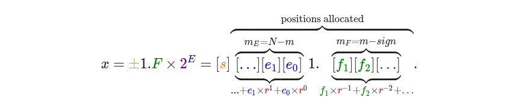
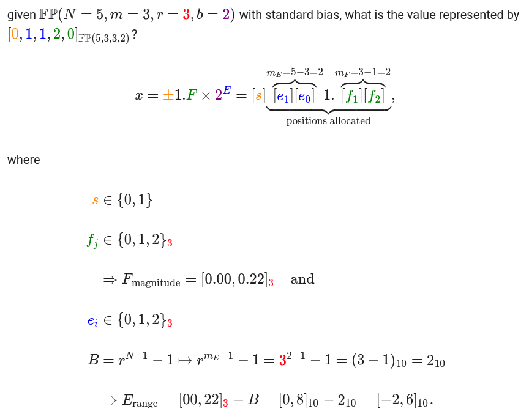
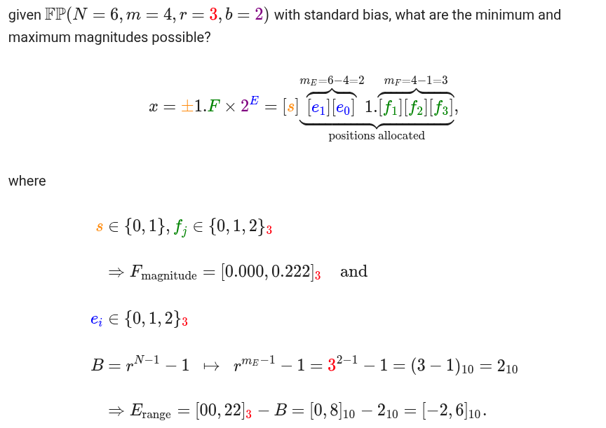
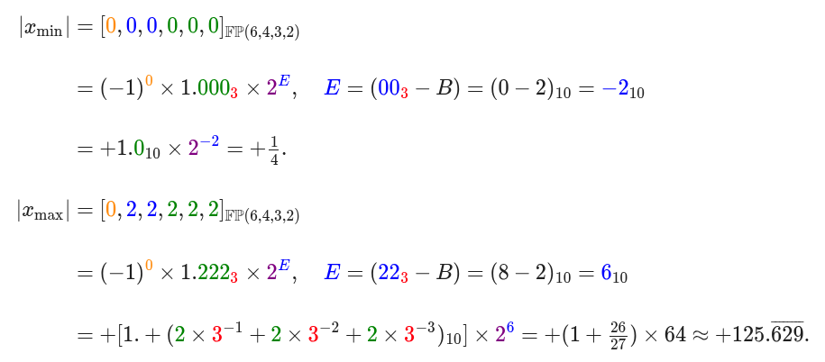
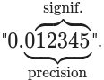

# 00.01 basics: polynomials & floating point

<details>

<summary>code, setup and dependencues</summary>

```python
if True: # settings for the people
  import matplotlib.pyplot as plt
  import numpy as np
```

```python
def img_fps():
  es = [-2,-1,0,1,2]
  ms = np.arange(1,2,0.125) # implicit 1 + 3 position binary fractional
  zeros = np.zeros_like(ms)

  # plot
  plt.close("all")
  plt.figure(figsize=(20,2))

  plt.plot([0,8],[0,0],color="0.5")
  for e in es:
    xs = ms*pow(2,e)  # + mantissa x base^e
    plt.scatter(xs,zeros,marker="|",s=500)
    s_e = "$2^{" + f"{e}" + "}$"
    plt.text(xs.min(),.015,s_e,size="xx-large")

  plt.axis("off")
  plt.show()
```

</details>

## 0 intro

<b>numerical methods</b>, as distinguished from other branches of mathematics and from computer science,

1. work with arbitrary real numbers (including rational <b>approximations</b> of irrational numbers) and
2. consider <b>cost</b> and
3. consider <b>accuracy</b>.[^1]

<i>this class will provide another way to express, to extend your math.</i>

numerical methods are the algorithms; <b>numerical analysis</b> is the study of their properties -- ie, accuracy, stability, convergence, efficiency, usw.

## 1 polynomials

<i>The most fundamental operations of arithmetic are <b>addition</b> and <b>multiplication</b>. These are also the operations needed to evaluate a polynomial `p(x)` at a particular value `x`. It is no coincidence that polynomials are the basic building blocks for many computational techniques we will construct.[^2]</i>

### i) evaluation

<details><summary>example 01</summary><br/>

consider: `p(x) = a₄x⁴ + a₃x³ + a₂x² + a₁x + a₀`

with computational considerations:

1. <b>approximate</b> `p(x)` at `x` while
2. minimizing <b>operations</b> and
3. maximizing <b>accuracy</b>.

wrt operations,

- method 1, step individually:
  - `p(x) = a₄·x·x·x·x + a₃·x·x·x + a₂·x·x + a₁·x + a₀ ↦ 14` operations.

- method 2, cache and reuse:
  - `x₂ = x·x, x₃ = x₂·x, x₄ = x₃·x ↦ 3` operations;
  - `p₄ = a₄·x₄, p₃ = a₃·x₃, p₂ = a₂·x₂, p₁ = a₁·x₁ ↦ 4` operations;
  - `p(x) = p₄ + p₃ + p₂ + p₁ + a₀ ↦ 4` operations `↦ 11` operations total.

- method 3, nested multiplication ([horners method](https://en.wikipedia.org/wiki/Horner%27s_method)):
  - `p(x) = (((a₄·x + a₃)·x + a₂)·x + a₁)·x + a₀ ↦ 8` operations.

</details>

## 2 binary notation

### i) conversion to decimal

    `⇒ ... b₂·2² + b₁·2¹ + b₀·2⁰ + b₋₁·2⁻¹ + b₋₂·2⁻² ...`

<details><summary>example 02</summary><br/>

evaluate `111.11₂`.

```
       integer: 1·2² + 1·2¹ + 1·2⁰ = 4 + 2 + 1 = 7₁₀.
    fractional: 1·2⁻¹ + 1·2⁻² = ½ + ¼ = (¾)₁₀.

        111.11₂ ⇒ 7₁₀ + (¾)₁₀ = 7.75₁₀.
```

</details>

### ii) conversion from decimal

<details><summary>example 03</summary><br/>

evaluate `111.25₁₀`.

```
       integer:  111·½ = 55 R 1
                      55·½ = 27 R 1
                  27·½ = 13 R 1
                  13·½ =  6 R 1
                   6·½ =  3 R 0
                   3·½ =  1 R 1
                   1·½ =  1 R 1
                 111₁₀ ⇒ 1101111₂, remainders in reverse order.

    fractional: 0.25·2 = 0.50 + 0
                0.50·2 = 0.00 + 1
                0.25₁₀ ⇒ 0.01₂,    integers in order from left to right.

              111.25₁₀ ⇒ 1101111₂ + 0.01₂ = 1101111.01₂.
```

</details>

## 3 polynomials in the machine

### i) digital representation

```
    x = [dₙ₋₁,...,d₁,d₀]                  𝗱𝗶𝗴𝗶𝘁𝗮𝗹 𝘃𝗲𝗰𝘁𝗼𝗿
      =  dₙ₋₁·bⁿ⁻¹ + ... + d₁·b¹ + d₀·b⁰  𝗽𝗿𝗲𝗰𝗶𝘀𝗶𝗼𝗻 𝗡 (n) and 𝗯𝗮𝘀𝗲 𝗯.
```

<details><summary>example 04</summary><br/>

- base 10: `500₁₀ = [5,0,0]; [5] = 5₁₀`.
- base 02: `[1,0,1] = 101₂ = 1·2² + 0·2¹ + 1·2⁰ = 4 + 0 + 1 = 5₁₀`.

</details>

### ii) fixed/positional representation

<details><summary>example 04, continued</summary><br/>

- base 02: `101`<mark>`₂`</mark>` = 1·`<mark>`2`</mark>`² + 0·`<mark>`2`</mark>`¹ + 1·`<mark>`2`</mark>`⁰`

where RHS is <b>fixed representation</b> and LH subscript is the base or <b>radix</b> `r`.

additionally, precision `N ≥ 1`, `r ≥ 2` such that

    `x = ∑ⁿ dₖrᵏ has rⁿ 𝗽𝗲𝗿𝗺𝘂𝘁𝗮𝘁𝗶𝗼𝗻𝘀`

and can also be written as

    `rⁿ = (r-1)·`<mark>`(rⁿ⁻¹)`</mark>` + (rⁿ⁻¹) = [r-1]ₙ₋₁·`<mark>`[r]ₙ₋₂ ... [r]₁[r]₀`</mark>` + [r]₋₁[r]₋₂ ... [r]ₙ₋₂[r]ₙ₋₁`

where subscripts denote position wrt exponent.

</details>

<details><summary>example 05</summary><br/>

describe set where `N=3`, `r=2`.

```
    permutations: rⁿ = 2³ = 8
                     = (r-1)·r₁·r₀ + r₋₁·r₋₂ = (2-1)·2·2 + 2·2 = 4 + 4 = 8 ✓

                     = {000,001,010,011,100,101,110,111};

       magnitude: ∑ⁿ⁻¹ dₖrᵏ ≤ ∑ⁿ⁻¹ (r-1)rᵏ = rⁿ - 1 ⇒ range* [0,rⁿ - 1] = [0,7]₁₀.
```

*note: "range of magnitude" of `x` is also "range" of `x` bc representation of this `x` does not allow for sign.

</details>

### iii) sign

sign extends range.

- method 1: use position `dₙ₋₁` for sign.

```
                  x = [±]ₙ₋₁[dₙ₋₂,...,d₁,d₀] and

    permutations: rⁿ⁻¹·2;
           range: [-rⁿ⁻¹ + 1,0],[0,+rⁿ⁻¹ - 1]*
```

*note: yes, thats `-0` and `+0`. fun, right?

- method 2: use bias to obtain sign.

ie, all positions used for magnitude and <i>bias is an operation</i>.

```
       permutations: rⁿ;
    unbiased, range: [xₘᵢₙ,xₘₐₓ] = [0,rⁿ - 1]
      biased, range: [xₘᵢₙ,xₘₐₓ] - B = [-B,(rⁿ - 1) - B]
```

and <b>standard bias</b> `B = rⁿ⁻¹ - 1`.

<details><summary>example 06</summary><br/>

example 06 extends example 05 wrt standard bias.

```
           B = rⁿ⁻¹ - 1 = (2)⁽³⁻¹⁾ - 1 = 4 - 1 = 3 and
    range: [000,111]₂ ↦ [0,7]₁₀ − B = [−3,+4]₁₀.
```

</details>

## floating-point

there is some `x ∈ 𝔽ℙ`. also / remember `𝔽ℙ ⊂ ℝ`.

`x=M·bᴱ` , where <b>mantissa</b> `M` is an integer represented by sign, magnitude, radix and <b>precision</b> `m`; <b>exponent</b> `E` is an integer represented by bias and same radix. also, `M` is <b>normalized</b> as `1.F`, where `"1."` is implicit and <b>fractional</b> `F` is

    `F = ∑ᵐ⁻² dₖrᵏ, r ≥ 2 ⇒ x = ± 1.F × bᴱ`.

ie, same `r` for `M`,`E`; `m` includes sign; `mᴱ = N − m`; `B = rⁿ⁻¹ − 1` with bias power `N − 1 = mᴱ − 1`. note: `b` is the base of the exponent and not the base of the exponents power.

```
                             positions allocated      
                        |----------------------------|
                         mₑ = N - m      mₘ = m - sign
                        |-----------|    |-----------|
                                                      
    x = ±1.F × bᴱ = [s] [...][e₁][e₀] 1. [f₁][f₂][...]
```



<details><summary>example 07</summary><br/>

[]()
[]()

</details>

<details><summary>example 08</summary><br/>

[]()
[]()

</details>

### i) denormalized vs normalized

a base-2 floating-point number will always start with `"1"`, so its inclusion is implied. explicitly, `1×2⁰` is a given so the position it might have used is given over to the fractional part of the mantissa. that is the normalized mantissa.

however, if the biased exponent is zero, the mantissa is denormalized or subnormal. ie, there is no implicit `"1"`. <i>(note: this is a feature of the standard IEEE-754 and not necessarily a feature of other FPS.)</i>

    eg, `Bᵢₑₑₑ₇₅₄ = 126 ⇒ [0][00000000]0.[00010…0] = +(1×2⁻⁴)×(2⁰⁻ᴮ) = +2−¹³⁰`.[^3]

### ii) IEEE 754

the standard is [IEEE](https://www.ieee.org/) [754](https://en.wikipedia.org/wiki/IEEE_754)-[2019](https://standards.ieee.org/ieee/754/6210/), `𝔽ℙ(N−1,m,r,b) = 𝔽ℙ(64,53,2,2)`, where 32-bit is single precision and 64-bit is double-precision.

### iii) hexadecimal vs binary

IEEE 754 stores floating-point numbers using binary format; however, hexadecimal ([base 16](https://en.wikipedia.org/wiki/Hexadecimal)) representation of those bits is considered more human friendly.

consider the approximation of `π`:

```
π = 3.14159265358979

IEEE 754: 01000000000100100000111110111010111
Sign Bit: 0
Exponent: 10000000 (128 in decimal, after subtracting the bias of 127)
Mantissa: 00100100000111110111010111

Hex     : 0x40490FDB
Sign Bit: 0
Hex Flag: x
Exponent: 40
Mantissa: 490FDB
```

### iv) computer science vs engineering

so thats `N` as precision is wrt `𝔽ℙ`. in the broader world of application known as engineering, <b>precision</b> is known as resolution or wrt digits around the decimal and <b>significance</b> refers to the reliably known digits -- ie, the mantissa or <b>significand</b>.

[]()

- `0.012345` above has 5 degrees of significance and 6 degrees of precision.
- `1.2345 E+20 = 12,345,000,000,000,000,000` which has the same degree of significance but 20 degrees of precision.
- `1.2345 E+02 = 123.45` which has the same degree of significance and is precise to two decimals.
- `1.2345 E−02 = 0.012345` which has the same degree of significance and is precise to six decimals.

### v) observations

- gaps between adjacent numbers scale with magnitude of number represented. (ie, consider negative exponents vs positive exponents.)

    `...  2⁻²      2⁻¹       2⁰          2¹             2²        ...` <br/>
    `... |||  ... | | | ... |  |  | ... |   |   | ... |    |    | ...`

- machine epsilon, `ϵₘ`, is the gap between `1` and the next `FPN`.
- unit roundoff, `μₘ = ½ϵₘ`.
- for all `x` there exists a floating-point `x′` such that `|x−x′| ≤ μₘ × |x|`.
when `M` normalized, zero is represented by `ϵ = ϵₘᵢₙ − 1`.
- `±∞` returned when and operation overflows.
- `x±∞` returns `0` and `x/0`  returns `±∞`.
- "not a number" (`NaN`) is returned if no well-defined finite or infinite result.
- [und so weiter](https://dict.leo.org/german-english/und%20so%20weiter).

## resources

- horners method [@wiki](https://en.wikipedia.org/wiki/Horner%27s_method)
- telescoping sum [@wiki](https://en.wikipedia.org/wiki/Telescoping_series)
- floating-point [@wiki](https://en.wikipedia.org/wiki/Floating-point_arithmetic) [@youtube #1](https://www.youtube.com/watch?v=dQhj5RGtag0) [#2-pt1](https://www.youtube.com/watch?v=gc1Nl3mmCuY) [#2-pt2](https://www.youtube.com/watch?v=b2FgF2sUoS8)
- unit in last place (ulp) [@wiki](https://en.wikipedia.org/wiki/Unit_in_the_last_place)
- machine epsilon [@wiki](https://en.wikipedia.org/wiki/Machine_epsilon)
- [IEEE](https://www.ieee.org/) [754](https://en.wikipedia.org/wiki/IEEE_754)-[2019](https://standards.ieee.org/ieee/754/6210/)

## references

[^1]: johnson, sg. <i>[18.335, introduction to numerical methods](https://ocw.mit.edu/courses/18-335j-introduction-to-numerical-methods-spring-2019/),</i> mit.ocw, spring 2015.
[^2]: sauer, tim. <i>numerical analysis, 2nd edition</i>, pearson education, 2012, p1.
[^3]: nerdfirst. <i>[denormal numbers](https://www.youtube.com/watch?v=b2FgF2sUoS8)</i>, [0612 tv](https://www.youtube.com/@NERDfirst), 2020.
